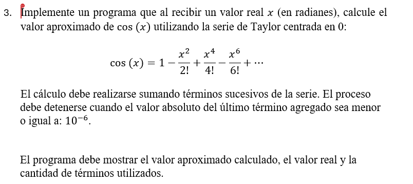

# Ejercicios – Clase 2: Estructuras Repetitivas

## Indicaciones
- Resolver primero en **PSeInt**
- Luego traducir a **C++**
- Probar con diferentes valores
- Analizar casos límite

---

## 1. Contador simple
Escribir un programa que muestre los números del 1 al 10.

---

## 2. Contador inverso
Mostrar los números del 10 al 1.

---

## 3. Suma de los primeros N números
Solicitar un número N y calcular la suma desde 1 hasta N.

Ejemplo:  
N = 5 → 1 + 2 + 3 + 4 + 5 = 15

---

## 4. Tabla de multiplicar
Pedir un número y mostrar su tabla de multiplicar del 1 al 12.

---

## 5. Validación de nota
Solicitar una nota entre 0 y 20.  
Repetir mientras el valor sea inválido.

---

## 6. Promedio de notas
Pedir 5 notas y calcular el promedio.

---

## 7. Suma hasta cero
Solicitar números al usuario y sumarlos.  
El programa termina cuando el usuario ingresa 0.

---

## 8. Número mayor
Ingresar 5 números y determinar cuál es el mayor.

---

## 9. Menú interactivo
Crear un menú con las siguientes opciones:

1. Sumar dos números  
2. Restar dos números  
0. Salir  

El programa debe repetirse hasta que el usuario elija salir.

---

## 10. Adivina el número 
El programa debe tener un número secreto (por ejemplo 7).  
El usuario debe intentar adivinarlo.

El programa debe:
- Indicar si el número es mayor o menor  
- Repetir hasta que acierte  
- Contar cuántos intentos realizó  

---

## Adicionales

Modificar el ejercicio 10 para que:
- El número sea aleatorio  
- Limitar la cantidad de intentos  
- Mostrar mensaje de victoria o derrota  

---

## Sugerencia

Antes de programar, responde:
- ¿Qué variable controla el ciclo?
- ¿Cuándo termina el ciclo?
- ¿Qué se actualiza en cada iteración?

> Si repites código… necesitas un ciclo.

---

## Errores comunes a evitar

- No actualizar la variable de control  
- Condiciones incorrectas  
- Bucles infinitos  
- No validar entradas  

