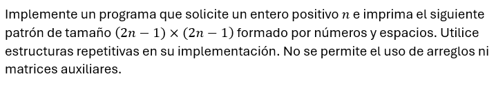
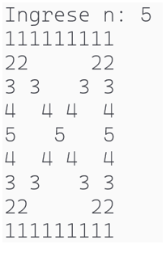
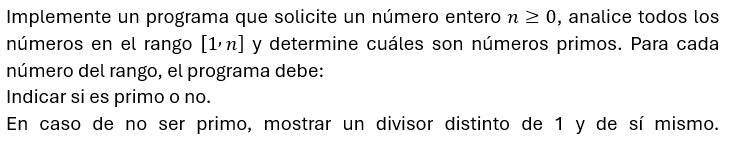
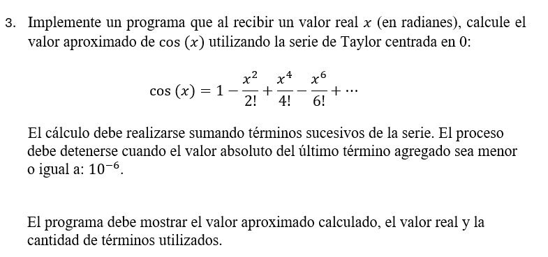

# Ejercicios de Estructuras Repetitivas y Anidadas (C++)

Resuelve los siguientes ejercicios utilizando estructuras repetitivas (`for`, `while`, `do-while`) y cuando sea necesario, estructuras anidadas.

---

## Ejercicio 1: Número espejo parcial
Dado un número entero positivo, verificar si la **primera mitad de sus dígitos** es igual a la segunda mitad invertida.

Ejemplo:
- 123321 → válido
- 123421 → no válido
---

## Ejercicio 2: Conteo condicionado de primos
Leer dos enteros `A` y `B` (A < B). Contar cuántos números primos hay en el rango [A, B], pero **solo aquellos cuya suma de dígitos también sea primo**.

---

## Ejercicio 3: Patrón triangular con condición
Imprimir un triángulo de altura `n` tal que:

- En cada fila solo se impriman números pares
- Cada fila debe reiniciar desde 2

Ejemplo (n=4):

2  
2 4  
2 4 6  
2 4 6 8  

---

## Ejercicio 4: Serie con control de error
Leer números hasta que el usuario ingrese un número negativo.

- Contar cuántos números fueron ingresados
- Calcular el promedio de los números positivos
- Indicar si hubo al menos un número múltiplo de 7

---

## Ejercicio 5: Patrón rectangular 
Simular una matriz de tamaño `n x n` donde:

- Si i == j → imprimir 1
- Si i < j → imprimir 0
- Si i > j → imprimir -1

Ejemplo (n=3):

1 0 0  
-1 1 0  
-1 -1 1  

---

## Ejercicio 6: Número con propiedad especial
Un número es "interesante" si:

- Tiene al menos un dígito par y uno impar
- La suma de sus dígitos es múltiplo de 3

Leer números hasta ingresar 0 y contar cuántos son "interesantes".

---

## Ejercicio 7: Subseries crecientes
Leer una secuencia de números terminada en 0.

Determinar cuántas veces aparece una subsecuencia estrictamente creciente consecutiva.

Ejemplo:
Entrada: 1 2 3 2 3 4 1 0  
Salida: 2

---

